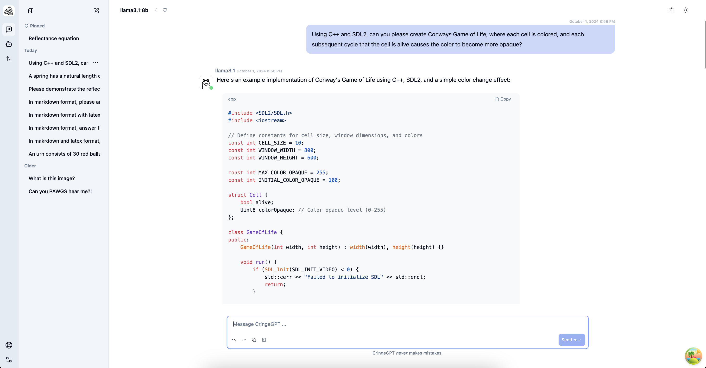
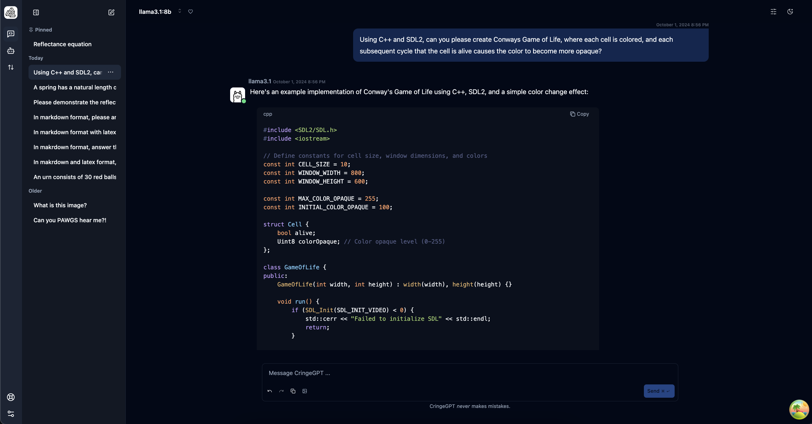
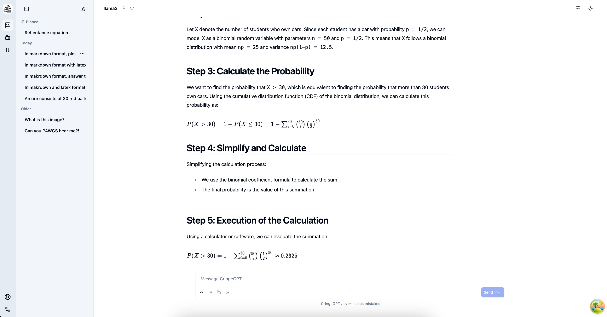
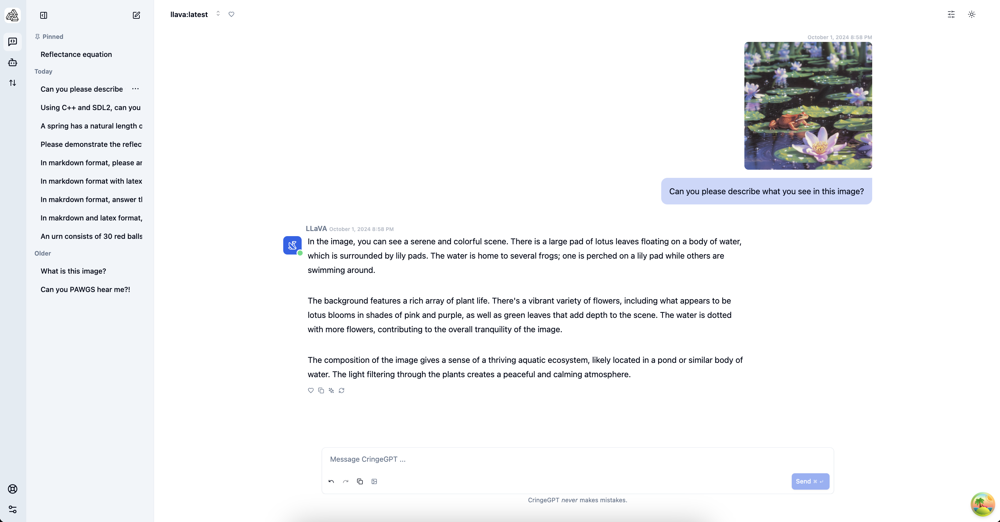

<div style="width: 100%;" align="center">
  <a href="https://github.com/nulzo/ollama-webui">
    
  </a>
</div>

<div style="width: 100%;" align="center">
  <a href="https://github.com/nulzo/ollama-webui">
    
  </a>
</div>

#

# CringeGPT: A Feature-Rich Web UI for Ollama

CringeGPT is a powerful and user-friendly web interface for Ollama, designed to enhance your interaction with large language models. This application offers a wide range of features to improve your AI-assisted workflow.

## Key Features

### Advanced Code Handling

- **Syntax Highlighting**: Enjoy beautiful and accurate syntax highlighting for a wide range of programming languages (via Highlight.js).
- **Code Blocks**: Easily share and view code snippets with proper formatting (with copy-to-clipboard functionality).



### Customizable Themes

- **Light and Dark Modes**: Switch between light and dark themes to suit your preference.
- **6 Color Themes**: Choose from a variety of color schemes to personalize your experience.



### Rich Text Rendering

- **Markdown Support**: Write and view content in Markdown for enhanced readability.
- **LaTeX Integration**: Seamlessly include mathematical equations and formulas using LaTeX syntax.
  

### Vision Model Compatibility

- **Image Upload**: Easily upload images for analysis by vision-capable models.
- **Multi-Modal Interaction**: Combine text and image inputs for more comprehensive AI interactions.



### Additional Features

- **Real-time Chat**: Engage in fluid conversations with AI models.
- **Model Selection**: Choose from various available models to suit your specific needs.
- **Conversation History**: Keep track of your past interactions for easy reference.
- **Responsive Design**: Enjoy a seamless experience across desktop and mobile devices.

## Local Deployment

> [!IMPORTANT]  
> Ollama WebUI is designed to work with Ollama, a local AI model server. To use Ollama WebUI, you need to have Ollama installed and running on your machine. You can download Ollama from the [official website](https://ollama.com/).

To set up CringeGPT, follow these steps:

1. Clone the repository:
   ```
   git clone https://github.com/nulzo/ollama-webui.git
   ```
2. Navigate to the project directory:
   ```
   cd ollama-webui
   ```
3. Install frontend dependencies:
   ```
   cd frontend && npm install
   ```
4. Install backend dependencies:
```
cd backend && poetry shell && poetry install
```

5. Start the frontend server:
   ```
   cd frontend && npm run dev
   ```
6. Start the backend server:
   ```
   cd backend && poetry run python manage.py runserver 0.0.0.0:6969
   ```

## Deployment with Docker

> [!TIP]
> The default Ollama server is configured to run on port 11434. If this is already being used by another application, you can change the port in the `docker-compose.yml` file or the `Dockerfile`. If you are running locally, you can change this in the settings files for the frontend and backend.

We provide a `docker-compose.yml` file to simplify the setup process. This will generate three containers, one for the backend, one for the frontend, and one for the nginx proxy. 

Likewise, we provide a `Dockerfile` to build a single container for the backend serve combined with the frontend service.

### Run with docker-compose
To build and run the application with docker-compose, run the following command:
```
docker-compose up --build
```

### Run with Dockerfile
To build and run the application with Dockerfile, run the following command:
```
docker build -t cringegpt . && docker run -d -p 8080:8080 cringegpt
```

## Usage

After starting the application, you can:

1. Select a model from the available options.
2. Start a new conversation or continue an existing one.
3. Type your message or question in the input box.
4. For image analysis, click the upload button to include an image with your query.
5. Use Markdown or LaTeX in your messages for rich text formatting.
6. Explore different themes by accessing the settings menu.

> [!NOTE]  
> For a comprehensive guide on using all features, check out our [User Manual](docs/readme.md).


